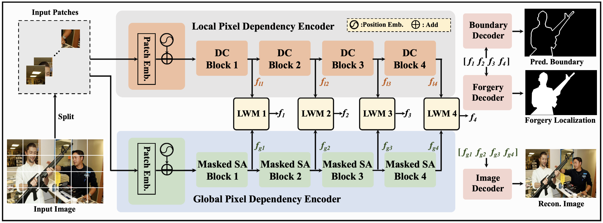

# Introduction
**Pytorch implementation of "Pixel-inconsistency modeling for image manipulation localization", IEEE TPAMI 2025.**
<p align="center">
 
</p>
Proposed Pixel Inconsistency Modeling (PIM) framework for image forgery localization. 

# Pretrained models
Google drive:
https://drive.google.com/file/d/13hf4l7mPnbdHoIEaAtIINRx8Vy4hL_Tj/view?usp=sharing

Onedrive:
https://entuedu-my.sharepoint.com/:u:/r/personal/chenqi_kong_staff_main_ntu_edu_sg/Documents/ckpt.pth?csf=1&web=1&e=IpPkrx

Baiduyun: https://pan.baidu.com/s/15NwLwujZ57ssmTvEjwUYsw (PW: ubt4) 

# Usage
Download the pretrained ckpt.pth and place it under the folder 'model'.

# Prerequisites:
See environment.yml

# Citation
```
@article{kong2025pixel,
  title={Pixel-inconsistency modeling for image manipulation localization},
  author={Kong, Chenqi and Luo, Anwei and Wang, Shiqi and Li, Haoliang and Rocha, Anderson and Kot, Alex C},
  journal={IEEE Transactions on Pattern Analysis and Machine Intelligence},
  year={2025},
  publisher={IEEE}
}
 ```

